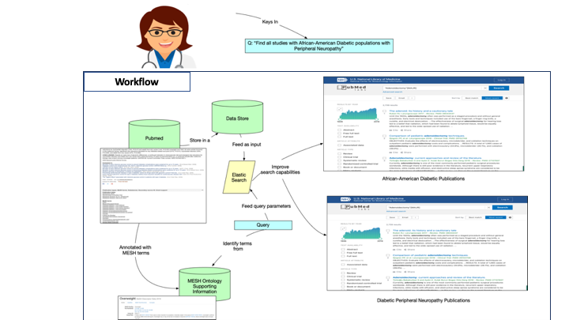

# Broadening Usability of Pubmed

### Goal

`What is Pubmed:` PubMed is a free search engine accessing primarily the MEDLINE database of references and abstracts on life sciences and biomedical topics.

Current search capabilities on Pubmed (the latest alpha version)allows for search on Pubmed articles which is based on mesh terms. It’s impractical to assume that non-experts know about the mesh terms or their usage. It does not consider cultural differences in the terms used to describe diseases, conditions, and related information.

For example, search for “Diabetes Melitus” may not be a common practice. But search for Diabetes, Sugar, and so on is more reasonable and expected from a wider audience searching for knowledge sources on pubmed. Specifically, a user may search using not just the term _diabetes_, but also _hypertension_, which may commonly be refered to as high BP. Another use case is that there are instances when search terms can be very restrictive and may not display enough results (this limitations currently exists). A potential way to address this problem is that we can relax search terms and display relevant results related to the scientist.

Therefore, we’re building a **search capability for wider usage** that can perform search on the Pubmed library of articles using commonly used words. 

### We’ve divided our project into multiple phases:

```
1. Given a search query, extract MeSH terms and display relevant publications
2. For restrictive queries that do not yield any or enough results, relax search terms and still display articles that are relevant and related to the User.
3. Enhance search capabilities using commonly used terms
4. Add multiple commonly used terms for search
5. Recommend search terms that can potentially help with a more targeted search
```

### Work Flow Diagram
   


### Steps in Phase I - PubMed Query using Mesh Ontology terms from the User Query

```
1. Download PubMed Dump from [https://www.nlm.nih.gov/databases/download/pubmed_medline.html]
2. Convert the data to JSON format
3. Store the data in MongoDB [https://www.mongodb.com/]
4. Download MeSH Ontology [https://www.nlm.nih.gov/mesh/filelist.html]
5. MeSH terms are queried from the search Query provided by the User
..* These MeSH terms are then used to find all the related articles from the PubMed
```

### Contributors

* _Shruthi Chari_
* _Neha Keshan_
* _Nkechinyere Agu_
* _Nidhi Rastogi_
* _Oshani W. Seneviratne_
